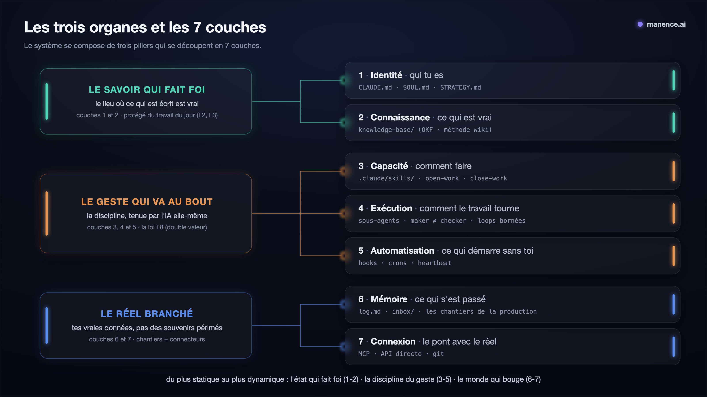
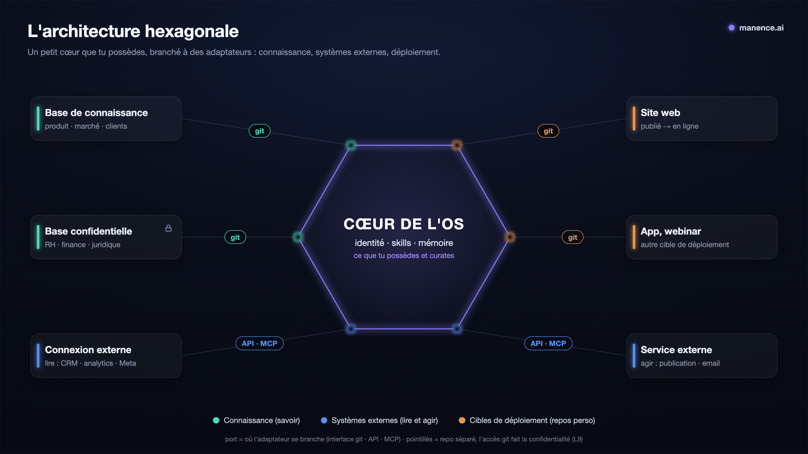

# Manifeste : Manence

> 🌐 **English** : [read in English](Manifesto.md) — la version de référence.

**Le travail avec l'IA ne tient pas dans le temps.** Ce n'est pas que l'IA oublie (elle a une mémoire) : c'est que tout s'accumule et que rien ne se range. Les brouillons finissent par ressembler à des décisions, le contexte enfle, les erreurs corrigées reviennent. Le chat subit le phénomène ; l'agentique, où l'IA **lit et écrit tes fichiers en continu**, le vit à la puissance dix.

**Manence est le cadre qui répond à ce problème, et son principe tient en une phrase : le système est le rangement.** Travailler doit produire l'ordre, au lieu d'exiger un rangement que personne ne tient. Concrètement, tu n'« utilises » pas un chatbot : tu fais tourner un **Operating System** : le modèle d'IA est le processeur, le contexte la RAM, tes fichiers (markdown + git) le disque, les skills les programmes. Ce manifeste en est le plan.

Ce document est le **fil unique** qui synthétise et **lie** les idées de **Manence OS (MOS)**. Chaque idée se déplie dans son propre fichier sous [`concept/`](concept/index.md) (un concept = un fichier) ; les sources vérifiées sont dans [`research/`](concept/research/index.md) ; le *comment mettre en place* (règles, gabarits, exemple) est dans [`implementation/`](implementation/index.md).

> **Convention de lecture** : au fil du texte, les renvois **L1 à L9** pointent vers les [9 lois transverses](#les-9-lois-transverses), la discipline du cadre, listée en fin de manifeste. *(Ex. **L2** = « un fait, un seul domicile » : on lie, on ne recopie pas.)*

## Index des concepts
- [Le modèle ordinateur](concept/modele-ordinateur.md) : CPU/RAM/disque, Software 3.0.
- [Le modèle de mémoire](concept/modele-memoire.md) : statique/dynamique, les 4 types de mémoire, la fraîcheur, quand une vraie base de données devient nécessaire.
- [La méthode wiki](concept/methode-wiki.md) : sources→wiki→schéma (Karpathy), ingest/query/lint.
- [Le format OKF](concept/okf.md) : le contrat de fichier, pourquoi pour l'IA.
- [L'architecture hexagonale](concept/architecture-hexagonale.md) : cœur + adaptateurs, ports, frontière, confidentialité par composition.
- [Les loops](concept/loops.md) : loops bornées, maker≠checker, mono ou groupe d'agents, vérification.
- [La double valeur](concept/double-valeur.md) : toute loop laisse une trace (LIVING REFERENCE, JP Noto).
- [L'atelier](concept/atelier.md) : le chantier, la table de routage, la boucle mesure → décision → production.
- [La frontière dure](concept/frontiere-dure.md) : dur vs mou, L9, sécurité + confidentialité, tiers.

---

## Le modèle mental : l'IA est un ordinateur

Karpathy (*Software 3.0*) pose qu'un LLM est un nouveau type d'ordinateur : le modèle est le processeur, le contexte la RAM (rare et chère, à garder au minimum utile), tes fichiers (markdown + git) le disque, les skills les programmes, les loops les workflows. D'où la thèse du cadre : **organiser ses projets pour l'IA, c'est concevoir le disque et les programmes d'un OS dont la RAM est minuscule et chère.**

**Conséquence forte : le modèle est un composant, pas le système.** Comme un CPU qu'on change sans jeter le disque, le modèle se débranche ; tout le reste (identité, savoir, mémoire, skills) **t'appartient**, en clair et versionné. C'est ce qui sépare un OS qu'on **possède** d'un « projet » hébergé chez un fournisseur.

→ détail (la table des équivalences et leurs conséquences directrices) : [modele-ordinateur](concept/modele-ordinateur.md).

---

## Les 2 questions qui rangent tout

Avant d'écrire le moindre fichier, deux questions suffisent à le placer :

1. **Statique ou dynamique ?** Ce qui change rarement (identité, règles, faits) **vs** ce qui s'accumule et se périme (événements, idées, brouillons).
2. **Quoi ?** *qui* je suis / *ce qui est vrai* / *comment* faire / *ce qui s'est passé*.

Ces deux axes donnent les **4 types de mémoire** du modèle CoALA : *comment faire* (procédurale), *ce qui est vrai* (sémantique), *ce qui s'est passé* (épisodique), *le raisonnement en cours* (working). Ces 4 types **fondent les couches 2, 3, 4 et 6** ; les couches 1 (identité), 5 (automatisation) et 7 (connexion) viennent de l'**architecture**, pas du modèle de mémoire.

> **Hors disque : la donnée accessible.** Beaucoup d'information utile **ne vit pas dans ton repo** (Gmail, CRM, analytics, DB, web) : tu la **montes à la demande** via la **couche 7**, tu ne la gardes pas. Ça vaut pour tout projet.

→ détail (la table CoALA, les domiciles, la fraîcheur) : [modele-memoire](concept/modele-memoire.md).

---

## Les trois organes (la lecture d'usage)

Vécu de l'utilisateur, le système tient en **trois organes** ; les couches, juste en dessous, en donnent la carte technique.

| L'organe | Ce qu'il recouvre dans le cadre |
|---|---|
| **Le savoir qui fait foi** : le lieu où ce qui est écrit est vrai | les couches 1 et 2 : l'identité + la knowledge-base OKF ([méthode wiki](concept/methode-wiki.md)), protégées du travail du jour (L2, L3) |
| **Le réel branché** : tes vraies données, pas des souvenirs périmés | les couches 6 et 7 : la mémoire et ses chantiers ([l'atelier](concept/atelier.md)) + les connecteurs MCP/API/git |
| **Le geste qui va au bout** : la discipline, tenue par l'IA elle-même | les couches 3, 4 et 5 (skills, exécution, automatisation) : la loi L8 ([double valeur](concept/double-valeur.md)), outillée par `open-work`/`close-work` |



## Les 7 couches (la carte de référence)

Chaque chose du système appartient à une couche, chaque couche a un domicile. Le détail de chacune vit dans sa page de [`concept/`](concept/index.md).

| Couche | Ce que c'est | Où ça vit |
|---|---|---|
| 1. **Identité** | *qui tu es* : posture, voix, cap | `CLAUDE.md` + `SOUL.md`/`STRATEGY.md`, dans le repo (seul le noyau invariant peut remonter dans `~/.claude/`) |
| 2. **Connaissance** | *ce qui est vrai* : les faits de tes domaines | `knowledge-base/`, un concept = un fichier ([OKF](concept/okf.md)), tenue par la [méthode wiki](concept/methode-wiki.md) |
| 3. **Capacité** | *comment faire* : les procédures réutilisables | `.claude/skills/`, chargées à l'usage (trois familles : base, projet, partagée) |
| 4. **Exécution** | *comment le travail tourne* | sous-agents au contexte isolé, **maker ≠ checker**, [loops bornées](concept/loops.md) |
| 5. **Automatisation** | *ce qui démarre sans toi* | hooks (garde-fous durs), crons, heartbeat ; seulement si le « fini » se vérifie objectivement |
| 6. **Mémoire** | *ce qui s'est passé* : événements, décisions, travail en cours | `log.md` (append-only), `inbox/`, les chantiers dans la production, hors git ([l'atelier](concept/atelier.md)) |
| 7. **Connexion** | *le pont avec le réel* (lire et agir) | MCP, API directe ou git ; on interroge le vivant, on ne l'aspire pas (L2, L8) |

---

## L'architecture : un cœur, des adaptateurs (hexagonal)

Les 7 couches disent *quels types de choses existent* ; l'hexagonal dit *où passe la frontière du repo* : **l'OS n'est pas un monolithe, c'est un petit cœur possédé qui branche des adaptateurs.**

- **Le cœur** (possédé, gardé au minimum, portable) : identité (1), skills (3), exécution (4), automatisation (5), mémoire/brouillons (6).
- **Les adaptateurs** (branchés, chacun son cycle de vie, **limités selon l'habilitation**) : bundles de connaissance (couche 2), bundles de capacité (skill + connecteur, couches 3+7), systèmes externes bruts (couche 7).
- **Les ports** : *connaissance · système externe · déploiement* ; l'**interface** est **git**, **API** ou **MCP**.

**Le test de la frontière** : *« qui possède le cycle de vie de cette chose ? »* L'OS → cœur ; owner/deploy/partage propre → adaptateur branché.



**Monolithe d'abord** : un projet solo simple reste un seul repo ; on ne dégroupe en adaptateurs que sur une vraie force motrice (partage, confidentialité, deploy séparé).

→ détail (confidentialité par composition, déployer une instance, solo → organisation) : [architecture-hexagonale](concept/architecture-hexagonale.md).

---

## Les 9 lois transverses

La discipline qui fait que ça marche (sans elle, l'arborescence ne sert à rien) :

- **L1 : Le contexte est de la RAM.** Le plus petit ensemble de tokens à haut signal. Trop de contexte = *context rot*.
- **L2 : Un fait, un seul domicile.** Jamais de duplication : on lie, on ne réénonce pas.
- **L3 : Séparer statique et dynamique.** Référence (réécrite sur place) ≠ log (daté, jamais réécrit).
- **L4 : Maker ≠ checker, et vérification externe.** Le producteur est le pire juge ; le vérificateur rapporte ce que dit un script/test.
- **L5 : Loops bornées seulement.** Condition de succès en une phrase **avant** de lancer ; 3 limites dures (max-turns, budget, non-progrès).
- **L6 : Un fichier = une idée, nommé pour l'humain, typé.** `sujet/chose-precise.md` + frontmatter `type:`.
- **L7 : Ingérer = intégrer.** Une connaissance nouvelle met à jour les pages existantes et signale les contradictions.
- **L8 : Double valeur, toute loop laisse une trace.** Chaque interaction utile fait avancer le travail **et** produit une trace réutilisable. Pont entre Exécution (4) et Mémoire (6). → [double-valeur](concept/double-valeur.md) *(LIVING REFERENCE de JP Noto, projet privé, crédité avec son accord)*.
- **L9 : Une contrainte dure = une frontière physique.** Sécurité ou confidentialité : **actions** → hook `PreToolUse`/`permissions.deny` ; **données** → repo séparé + accès git. Jamais un flag. Trois corollaires : **zéro-connaissance** (le cœur partagé ne mentionne même pas l'existence d'un adaptateur confidentiel), **le partage est une release, pas le dépôt** (on déploie un sous-ensemble curé, jamais le working tree ni l'historique), et **le garde-fou des écritures externes** (lire dehors est libre ; écrire chez un tiers = GO explicite, dry-run quand l'API l'offre, avant/après tracé, créer en pause d'abord ; credentials de lecture et d'écriture séparés). → [frontiere-dure](concept/frontiere-dure.md).

---

## Le layout physique

Une installation complète du cadre, dédiée à une activité, s'appelle un **MOS** (Manence OS) : c'est le **conteneur** ci-dessous. En son centre, **le cœur** — le dépôt git *dans lequel on lance l'IA* ; tout le reste (savoir, site, production, adaptateurs) se range autour, idéalement dans le même conteneur. Combien de MOS ? Chacun découpe comme il veut, mais en général **le système suit le capital** : un MOS par périmètre de propriété/confidentialité (le [test de la frontière](concept/architecture-hexagonale.md) à l'échelle de l'installation entière).

```
<conteneur>/                     ← LE MOS : un dossier simple (non-repo), le cœur + ce qu'il branche
  <un-projet>/                   ← LE CŒUR (on lance l'IA ici), un dépôt git : on ne versionne que le système et le savoir
    CLAUDE.md                     COUCHE 1 : qui je suis ici + comment bosser (lean, <200 l.)
    SOUL.md · STRATEGY.md         COUCHE 1 : la voix, le cap (convention openclaw)
    .claude/
      skills/                     COUCHE 3 : capacités du projet
      agents/                     COUCHE 4 : exécution (maker/checker, executors)
      settings.json               COUCHE 5 : hooks
    .mcp.json                     COUCHE 7 : connecteurs MCP
    scripts/ + .env               COUCHE 7 : appels API directs (clés en .env, gitignored)
    knowledge-base/               COUCHE 2 : bundle OKF (index.md · <concept>.md · log.md)
    templates/chantier/           gabarit de chantier (copié par open-work)
    inbox/                        capture brute à trier
    log.md                        COUCHE 6 : épisodique, append-only
  production/                    ← COUCHE 6, HORS git ($<PROJET>_PRODUCTION_ROOT, défaut ../production)
    <domaine>/                    un domaine par métier, créé au premier besoin
      in-progress/<slug>/         les chantiers en cours (l'atelier) : textes ET assets ensemble
      done/YYYYMMDD-<slug>/       clos, daté, jamais réécrit (préfixe date = tri chrono)

~/.claude/   (OPTIONNEL, seulement si plusieurs activités)   ← noyau d'identité dé-dupliqué
  CLAUDE.md                       le noyau invariant (langue, façon de bosser, éthique)
  skills/ · agents/               skills & sous-agents partagés par tous les projets
```

Ci-dessus = le cas **monolithe** (solo-simple : un seul repo, plus sa production à côté). La production n'est **pas versionnée** : ses artefacts sont jetables par doctrine, `close-work` est le seul garant de durabilité (distillation vers la KB + le log). Dès qu'un bundle est partagé/confidentiel, ou qu'une cible a son propre deploy, il **sort en adaptateur branché**, voir [architecture-hexagonale](concept/architecture-hexagonale.md).

---

## L'échelle de maturité

| Niveau | Ce qui le caractérise | Indice qu'on y est |
|---|---|---|
| **0** | Prompt à la main, tout recommence à froid | aucun fichier de contexte |
| **1** | `CLAUDE.md` + quelques skills par projet | l'agent connaît le projet |
| **2** | Connaissance statique séparée du travail dynamique (OKF) | une `knowledge-base/` versionnée, distincte de la production (hors git) |
| **3** | Identité rangée proprement + exécution isolée par sous-agents | identité au bon endroit, plus de copier-coller accidentel |
| **4** | Automatisation (heartbeat, hooks) + loops vérifiées (maker≠checker) | du travail démarre seul et se fait vérifier |
| **5** | Connecteurs de bout en bout, le système agit dans le réel | l'agent ouvre des PR, envoie, publie |

Le piège le plus commun : **rester au niveau 1 en se croyant plus haut**. Le plus haut levier : **passer le niveau 3**, ranger l'identité (dans le repo, autonome) et isoler l'exécution.

---

## En une phrase

> **Un fait a un seul domicile, tout travail naît en chantier au bon endroit, un petit cœur possédé branche le reste, le statique ne se mélange jamais au dynamique, une contrainte dure passe par une frontière physique, et rien ne tourne en boucle sans condition d'arrêt ni vérificateur externe.** Le reste n'est que de l'arborescence.

Sources : voir [research/](concept/research/index.md) (Karpathy & praticiens · architecture Anthropic · architectures mémoire · méthodes PKM · loops & orchestration).
