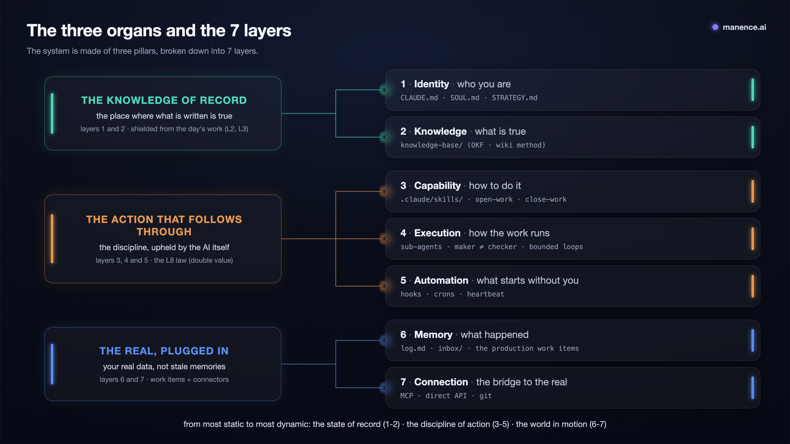

# Manifesto: Manence

> 🌐 **Français** : [lire en français](Manifesto.fr.md).

**Working with AI doesn't hold up over time.** The problem isn't that the AI forgets (it has a memory): it's that everything piles up and nothing gets filed. Drafts start to read like decisions, context swells, mistakes you already fixed come back. Chat suffers from this; agentic setups, where the AI **reads and writes your files continuously**, experience it tenfold.

**Manence is the framework that answers this problem, and its principle fits in one sentence: the system does the tidying.** Doing the work should produce order, instead of demanding an upkeep no one keeps. In practice, you don't "use" a chatbot: you run an **Operating System**. The AI model is the processor, context is the RAM, your files (markdown + git) are the disk, skills are the programs. This manifesto is its blueprint.

This document is the **single thread** that synthesizes and **links** the ideas of **Manence OS (MOS)**. Each idea unfolds in its own file under [`concept/`](concept/index.md) (one concept, one file); the verified sources are in [`research/`](concept/research/index.md); the *how to set it up* (rules, templates, a worked example) is in [`implementation/`](implementation/index.md).

> **Reading convention**: throughout the text, references **L1 through L9** point to the [9 cross-cutting laws](#the-9-cross-cutting-laws), the framework's discipline, listed at the end of the manifesto. *(E.g. **L2** = "one fact, one home": you link, you don't recopy.)*

## Index of concepts
- [The computer model](concept/modele-ordinateur.md): CPU/RAM/disk, Software 3.0.
- [The memory model](concept/modele-memoire.md): static/dynamic, the 4 types of memory, freshness, when a real database becomes necessary.
- [The wiki method](concept/methode-wiki.md): sources→wiki→schema (Karpathy), ingest/query/lint.
- [The OKF format](concept/okf.md): the file contract, why it fits AI.
- [Hexagonal architecture](concept/architecture-hexagonale.md): core + adapters, ports, the boundary, confidentiality by composition.
- [Loops](concept/loops.md): bounded loops, maker≠checker, single agent or agent group, verification.
- [Double value](concept/double-valeur.md): every loop leaves a trace (LIVING REFERENCE, JP Noto).
- [The workshop](concept/atelier.md): the workstream, the routing table, the loop measure → decision → production.
- [The hard boundary](concept/frontiere-dure.md): hard vs soft, L9, security + confidentiality, third parties.

---

## The mental model: AI is a computer

Karpathy (*Software 3.0*) argues that an LLM is a new kind of computer: the model is the processor, context is the RAM (scarce and expensive, kept to the useful minimum), your files (markdown + git) are the disk, skills are the programs, loops are the workflows. Hence the framework's thesis: **organizing your projects for AI means designing the disk and the programs of an OS whose RAM is tiny and expensive.**

**A strong consequence: the model is a component, not the system.** Like a CPU you swap without throwing out the disk, the model unplugs; everything else (identity, knowledge, memory, skills) **is yours**, in the clear and versioned. That's what separates an OS you **own** from a "project" hosted at a vendor.

→ detail (the equivalence table and its guiding consequences): [modele-ordinateur](concept/modele-ordinateur.md).

---

## The 2 questions that file everything

Before you write a single file, two questions are enough to place it:

1. **Static or dynamic?** What rarely changes (identity, rules, facts) **vs** what accumulates and goes stale (events, ideas, drafts).
2. **What?** *who* I am / *what is true* / *how* to do it / *what happened*.

These two axes give the **4 types of memory** from the CoALA model: *how to do it* (procedural), *what is true* (semantic), *what happened* (episodic), *the reasoning in progress* (working). These 4 types **ground layers 2, 3, 4 and 6**; layers 1 (identity), 5 (automation) and 7 (connection) come from the **architecture**, not from the memory model.

> **Off the disk: reachable data.** A lot of useful information **doesn't live in your repo** (Gmail, CRM, analytics, DB, the web): you **mount it on demand** through **layer 7**, you don't keep it. This holds for any project.

→ detail (the CoALA table, the homes, freshness): [modele-memoire](concept/modele-memoire.md).

---

## The three organs (the usage-side reading)

As the user lives it, the system comes down to **three organs**; the layers, just below, are its technical map.

| The organ | What it covers in the framework |
|---|---|
| **The knowledge that holds true**: the place where what's written is true | layers 1 and 2: your identity + the OKF knowledge base ([wiki method](concept/methode-wiki.md)), shielded from the day's work (L2, L3) |
| **The real world, wired in**: your actual data, not stale memories | layers 6 and 7: memory and its workstreams ([the workshop](concept/atelier.md)) + the MCP/API/git connectors |
| **The gesture carried through**: the discipline, held by the AI itself | layers 3, 4 and 5 (skills, execution, automation): law L8 ([double value](concept/double-valeur.md)), tooled by `open-work`/`close-work` |



## The 7 layers (the reference map)

Everything in the system belongs to a layer, and every layer has a home. The detail of each lives in its own page under [`concept/`](concept/index.md).

| Layer | What it is | Where it lives |
|---|---|---|
| 1. **Identity** | *who you are*: posture, voice, direction | `CLAUDE.md` + `SOUL.md`/`STRATEGY.md`, in the repo (only the invariant kernel may be lifted into `~/.claude/`) |
| 2. **Knowledge** | *what is true*: the facts of your domains | `knowledge-base/`, one concept per file ([OKF](concept/okf.md)), kept by the [wiki method](concept/methode-wiki.md) |
| 3. **Capability** | *how to do it*: reusable procedures | `.claude/skills/`, loaded when used (three families: base, project, shared) |
| 4. **Execution** | *how the work runs* | subagents with isolated context, **maker ≠ checker**, [bounded loops](concept/loops.md) |
| 5. **Automation** | *what starts without you* | hooks (hard guardrails), crons, heartbeat; only where "done" can be verified objectively |
| 6. **Memory** | *what happened*: events, decisions, work in progress | `log.md` (append-only), `inbox/`, and the workstreams in production, outside git ([the workshop](concept/atelier.md)) |
| 7. **Connection** | *the bridge to the real world* (read and act) | MCP, direct API, or git; you query the live world, you don't pull it in (L2, L8) |

---

## The architecture: one core, many adapters (hexagonal)

The 7 layers say *what kinds of things exist*; the hexagonal view says *where the repo's boundary runs*: **the OS isn't a monolith, it's a small owned core that plugs in adapters.**

- **The core** (owned, kept minimal, portable): identity (1), skills (3), execution (4), automation (5), memory/drafts (6).
- **The adapters** (plugged in, each with its own lifecycle, **scoped to clearance**): knowledge bundles (layer 2), capability bundles (skill + connector, layers 3+7), raw external systems (layer 7).
- **The ports**: *knowledge · external system · deployment*; the **interface** is **git**, **API** or **MCP**.

**The boundary test**: *"who owns this thing's lifecycle?"* The OS → core; owner/deploy/clean sharing → a plugged-in adapter.


**Monolith first**: a simple solo project stays a single repo; you only split into adapters on a real driving force (sharing, confidentiality, separate deploy).

→ detail (confidentiality by composition, deploying an instance, solo → organization): [architecture-hexagonale](concept/architecture-hexagonale.md).

---

## The 9 cross-cutting laws

The discipline that makes it work (without it, the tree structure is useless):

- **L1: Context is RAM.** The smallest set of high-signal tokens. Too much context = *context rot*.
- **L2: One fact, one home.** Never duplicate: you link, you don't restate.
- **L3: Separate static and dynamic.** Reference (rewritten in place) ≠ log (dated, never rewritten).
- **L4: Maker ≠ checker, and verification is external.** The producer is the worst judge; the checker reports what a script/test says.
- **L5: Bounded loops only.** A one-sentence success condition **before** you launch; 3 hard limits (max-turns, budget, no-progress).
- **L6: One file = one idea, named for the human, typed.** `subject/specific-thing.md` + a `type:` frontmatter.
- **L7: To ingest is to integrate.** New knowledge updates the existing pages and flags the contradictions.
- **L8: Double value, every loop leaves a trace.** Every useful interaction moves the work forward **and** produces a reusable trace. The bridge between Execution (4) and Memory (6). → [double-valeur](concept/double-valeur.md) *(JP Noto's LIVING REFERENCE, a private project, credited with his consent)*.
- **L9: A hard constraint = a physical boundary.** Security or confidentiality: **actions** → a `PreToolUse` hook / `permissions.deny`; **data** → a separate repo + git access. Never a flag. Three corollaries: **zero-knowledge** (the shared core doesn't even mention that a confidential adapter exists), **sharing is a release, not the repo** (you deploy a curated subset, never the working tree or the history), and **the guardrail on external writes** (reading outside is free; writing at a third party = explicit GO, a dry-run when the API offers one, before/after logged, create it paused first; separate read and write credentials). → [frontiere-dure](concept/frontiere-dure.md).

---

## The physical layout

A complete install of the framework, dedicated to one activity, is called a **MOS** (Manence OS): it's the **container** below. At its center, **the core** — the git repo *you launch the AI inside*; everything else (knowledge, site, production, adapters) sits around it, ideally in the same container. How many MOS? Everyone carves things up their own way, but as a rule **the system follows the capital**: one MOS per ownership/confidentiality perimeter (the [boundary test](concept/architecture-hexagonale.md) at the scale of the whole install).

```
<container>/                     ← THE MOS: a plain folder (non-repo), the core + what it plugs in
  <a-project>/                   ← THE CORE (you launch the AI here), a git repo: you version only the system and the knowledge
    CLAUDE.md                     LAYER 1: who I am here + how to work (lean, <200 lines)
    SOUL.md · STRATEGY.md         LAYER 1: the voice, the heading (openclaw convention)
    .claude/
      skills/                     LAYER 3: project capabilities
      agents/                     LAYER 4: execution (maker/checker, executors)
      settings.json               LAYER 5: hooks
    .mcp.json                     LAYER 7: MCP connectors
    scripts/ + .env               LAYER 7: direct API calls (keys in .env, gitignored)
    knowledge-base/               LAYER 2: OKF bundle (index.md · <concept>.md · log.md)
    templates/chantier/           workstream template (copied by open-work)
    inbox/                        raw capture to sort
    log.md                        LAYER 6: episodic, append-only
  production/                    ← LAYER 6, OUTSIDE git ($<PROJECT>_PRODUCTION_ROOT, default ../production)
    <domain>/                     one domain per line of work, created on first need
      in-progress/<slug>/         the workstreams in progress (the workshop): text AND assets together
      done/YYYYMMDD-<slug>/       closed, dated, never rewritten (date prefix = chrono sort)

~/.claude/   (OPTIONAL, only if several activities)   ← de-duplicated identity kernel
  CLAUDE.md                       the invariant kernel (language, way of working, ethics)
  skills/ · agents/               skills & subagents shared by all projects
```

The above = the **monolith** case (solo-simple: a single repo, plus its production alongside). Production is **not versioned**: its artifacts are disposable by doctrine, `close-work` is the sole guarantor of durability (distillation to the KB + the log). As soon as a bundle is shared/confidential, or a target has its own deploy, it **breaks out as a plugged-in adapter**, see [architecture-hexagonale](concept/architecture-hexagonale.md).

---

## The maturity scale

| Level | What defines it | Sign you're there |
|---|---|---|
| **0** | Prompting by hand, everything restarts from cold | no context file at all |
| **1** | `CLAUDE.md` + a few skills per project | the agent knows the project |
| **2** | Static knowledge separated from dynamic work (OKF) | a versioned `knowledge-base/`, distinct from production (outside git) |
| **3** | Identity filed cleanly + execution isolated by subagents | identity in the right place, no more accidental copy-paste |
| **4** | Automation (heartbeat, hooks) + verified loops (maker≠checker) | work starts on its own and gets checked |
| **5** | End-to-end connectors, the system acts in the real world | the agent opens PRs, sends, publishes |

The most common trap: **staying at level 1 while thinking you're higher**. The highest leverage: **clearing level 3**, filing identity (in the repo, self-standing) and isolating execution.

---

## In one sentence

> **A fact has a single home, all work is born as a workstream in the right place, a small owned core plugs in the rest, the static never mixes with the dynamic, a hard constraint runs through a physical boundary, and nothing runs in a loop without a stop condition and an external checker.** The rest is just tree structure.

Sources: see [research/](concept/research/index.md) (Karpathy & practitioners · Anthropic architecture · memory architectures · PKM methods · loops & orchestration).
