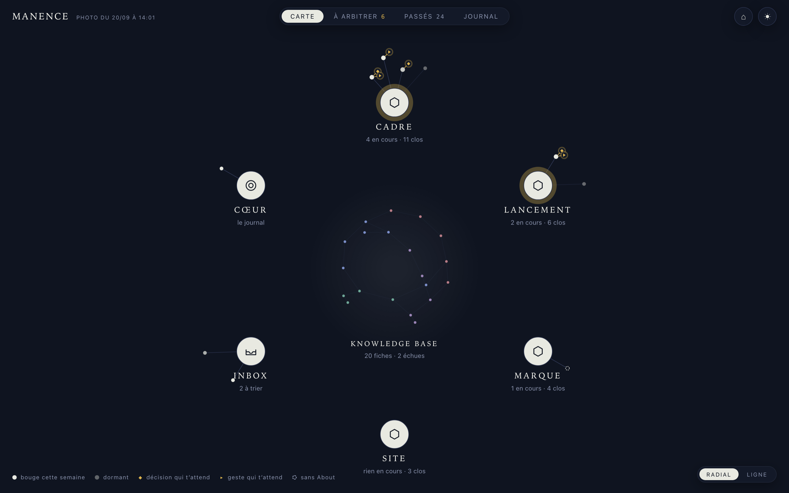

# Manence

> 🌐 **Français** : [lire en français](README.fr.md) — Manence was **born in French**. The doctrine now lives in English; a French presentation set ships with the repo (README, [Manifesto](Manifesto.fr.md), [QUICKSTART](QUICKSTART.fr.md)), and your own system installs in French if you ask.

**Manence makes your AI reliable on long-running projects.** An AI, whether in chat or agentic mode, knows only its context: what it has in front of it right now, nothing else. So whatever needs to last needs a place that outlives the session — and a way of working that keeps that place true. Manence is both: a work system where **every exchange does the work *and* tidies the system**. Order as a by-product, not a chore.



## The problem

With an AI, it's great at the start. It understands fast, produces fast, gets things right. Then the project runs on: conversations grow longer, drafts end up looking like decisions, mistakes you'd fixed come back.

**It's not that the AI forgets (it has a memory): it's that everything piles up and nothing gets put away.** An AI knows only its context, what it loads in the moment; the larger the corpus grows, the harder it is for the AI to grab the right piece at the right time. A chat is subject to this. Agentic work, where the AI reads and writes your files continuously, experiences it tenfold.

The problem is neither your prompt nor your model: it's that there's no system around it. And "you should tidy up" is no answer: tidying treated as a chore always loses to what's urgent. Companies have been paying for internal wikis for twenty years; they're never up to date.

## The answer: the system does the tidying

Manence is a work system where **working already produces order**. It rests on three organs:

1. **The knowledge that holds true.** A knowledge base where what's written is true: your products, your rules, your validated decisions. One fact, one home; never polluted by the day's work.
2. **The real world, wired in.** All work starts in a **workstream**, in its own space, with its context already linked, connected to your real tools (CRM, analytics, site, repositories). Your AI works on your real data, not on stale memories.
3. **The gesture carried through.** The rule that holds it all together: every exchange does the work **and** updates the system.
    - A decision made? Recorded, with its why.
    - A piece of information changed? The base is updated.
    - A mistake spotted? The fix is created, explained.

Then the curve reverses: every hour of work leaves the system healthier than it found it, and your AI always starts again from what's correct, the best context at the best moment. Tidying isn't a task: it's a by-product. On old Windows machines, you had to defragment the disk, a chore you'd put off for months; on Linux, the system tidies as it writes, and the notion of a defrag doesn't exist. That's the logic of Manence.

And you own it all: the code and templates are open source (MIT) — what the installation copies into your project is yours, no strings attached — and the doctrine is free to read, share, and adapt ([CC BY-NC-SA](LICENSE-docs.md)). Markdown + git, in plain text, at home: the AI model is an interchangeable component, you switch to an open source, sovereign, or self-hosted AI without rewriting a thing. *(A ChatGPT or Claude "project," by contrast, lives on their side: exportable, never truly yours.)*

## The mental model: you're running an OS

The framework builds on Karpathy's model (*Software 3.0*): the AI model is the **processor**, context the **RAM** (scarce and expensive, to load at the useful minimum), your files (markdown + git) the **disk**, skills the **programs**. Organizing your projects for the AI means designing the disk and programs of an OS whose RAM is tiny. The full plan: [Manifesto.md](Manifesto.md).

## Installation

One command, then one sentence to your agent:

```bash
curl -fsSL --proto '=https' --tlsv1.2 https://manence.ai/install.sh | bash
```

That puts a MOS in `~/manence`. Another folder: add `| bash -s -- ~/my-activity`. Prefer not to pipe? `git clone https://github.com/manence/manence.git && bash manence/install.sh`.

Already running one? `bash upgrade.sh <core>` carries a new version in without carrying your work out — see [UPGRADING.md](UPGRADING.md).

Then:

```bash
cd ~/manence/core
claude
```

Say: **"run my first setup"** (in French: « fais mon premier démarrage »). The agent interviews you, fills in the system, checks the guardrails, deletes the ritual. Installing is already using it. Details: [QUICKSTART.md](QUICKSTART.md).

**Seeing your MOS: Manence UI, a separate reader.** A MOS is plain files you can open by hand; Manence UI is a separate program, on its own release schedule, that reads one — what is in progress, what is done, what is waiting on someone — and never writes to it. A MOS is complete without it.

## The proof: it already runs on real work

This framework isn't a theory: it was built in production and runs there every day — on **its author's own three activities**, stated plainly. Proof of practice, not yet of adoption:

- **a SaaS company** (SMB, 18 employees): strategy, CRM, lead pipeline, support, daily monitoring, all journaled;
- **Manence itself**: this repository, its doctrine, and the [manence.ai](https://manence.ai) site are built and run under Manence;
- **a media outlet**: [declic.media](https://declic.media), 122 articles in three languages, complete editorial workflows.

A real trace, as it sits in the first one's journal — one morning, a lead lands in the CRM labeled "DIRECT, no source"; the system doesn't swallow it:

```
## [2026-06-14] fix | Web lead attribution
Lead "DIRECT, no source": CRM × analytics cross-check
→ true origin reconstructed: Brave Search, ~11 am (tracker blocked by an adblocker).
Measured: 39% of web leads (28/71) mislabeled for weeks.
Analysis delivered. Fix deployed the same day.
```

A real example. Six months after a workstream closes, someone asks: "why did we rule out option B again?" No need to dig up the conversation: the workstream's folder says who decided what, what was ruled out, and why. The AI reads it and answers in thirty seconds, with sources. Six months on, you understand what happened, not just the outcome. That's the gesture carried through.

## What Manence is not

You already have an AI memory, a notes app, and an agent that works in your folders with your tools. Those are the ingredients. The problem starts after: what holds true, what is only a draft, why option B was ruled out, and whether the figure in the CRM matches the analytics.

- **One more "memory."** Memory stores everything that passes through: accumulation sold as progress. After a few weeks it serves the mix back. Manence keeps a place where what's written is true, and protects it from the rest.
- **A second brain.** A personal wiki, you hold. Company wikis have existed for twenty years; they're never up to date. Tidying as a chore always loses. In Manence the AI holds the discipline as a by-product of the work: you don't take a second job as the archivist.
- **Cowork, Claude Code, or a bundle of MCPs.** An agent with hands is powerful. Access is not seeing together: isolated tools cannot see that an absurd figure in the CRM is glaring next to the same client's analytics. And nothing in the raw agent structures duration: no opening or closing of a project, no log of decisions, no boundary between the true and the draft. Manence is that structure, on top. Cowork gives it hands. Manence tells it what is true, what is in progress, and what is already settled.

## Multi-AI setup

Your system doesn't depend on one AI vendor. Everything that matters — knowledge, journal, workstreams — is plain markdown any agent can read; the identity file is the shared **`AGENTS.md`** standard; the skill files match the cross-tool Agent Skills format. The install ritual asks which agent will drive and wires it accordingly:

- **Claude Code** — the native path. Nothing to add.
- **Grok Build (xAI)** — reads `AGENTS.md` and the shipped `.claude/` wiring natively. Nothing to add.
- **OpenAI Codex** — reads `AGENTS.md` natively; the ritual poses a root `skills` link and a `.codex/config.toml` so the skills and the guardrail carry over.

One rule: one agent at a time on a container. Nothing is claimed as supported before it has been tested for real — the exact test status, layer by layer, is in **[PORTABILITY.md](PORTABILITY.md)**.

## The map

- **[QUICKSTART.md](QUICKSTART.md)**: the way in (who it's for, what it is, 3 moves). **Start here.**
- **[Manifesto.md](Manifesto.md)**: *the why*. The synthesis of the framework (mental model, 7 layers, hexagonal architecture, 9 laws, maturity) + the index of concepts.
- **[concept/](concept/index.md)**: each idea unfolded into a file, + [`research/`](concept/research/index.md) (the verified sources: Karpathy, OKF, Anthropic, PKM, loops, JP Noto's LIVING REFERENCE).
- **[implementation/](implementation/index.md)**: *the how*, with [Spec](implementation/Spec.md) (the rules), [Implementation](implementation/Implementation.md) (the playbook), [`mos/`](implementation/mos/BOOTSTRAP.md) (the default MOS, ready to copy: identity files, the 8 base skills (including outward-watch, the eye on the outside), hooks, the startup ritual that ends on your first workstream), and [`example/`](implementation/example/index.md) (a minimal KB that runs).
- **[CHANGELOG.md](CHANGELOG.md)**: the versions.

## The name

*Manence*, from the Latin *manere* (to remain), the root of **permanence**, **remanence**, and **immanence**: what stays when the conversation clears, what persists when the session closes, what remains with you when the model is unplugged. *Manence, like permanence without the “per”.*

## Lineage and credits

Manence synthesizes and builds tooling around ideas whose sources are named and documented in [`concept/research/`](concept/research/index.md): the computer model of **Andrej Karpathy** (*Software 3.0*), the **OKF** spec (Google), the **CoALA** memory model, the context-engineering practices of **Anthropic**, the identity conventions of the open source project **OpenClaw**, and **LIVING REFERENCE** by **JP Noto** (dual value, traced validation, the status lifecycle — and, since 0.4, the trace sieve, the revision trigger and the drift tests, under written agreement). The hexagonal framing and the 9 laws are original syntheses of the framework.

Created by **Alexandre Noto** ([Alex Déclic](https://www.youtube.com/@alexdeclic)), a SaaS executive who runs his own company with this framework.

## Licenses

Dual license, see [LICENSE.md](LICENSE.md) (the short version), [LICENSE](LICENSE) and [LICENSE-docs.md](LICENSE-docs.md):

- **Code and templates** (`implementation/mos/`, `implementation/example/`): **MIT**. What you copy into your project **is yours, no strings attached**.
- **Doctrine** (README, QUICKSTART, Manifesto, `concept/`, Spec, Implementation): **CC BY-NC-SA 4.0**. Free to read, share, and adapt with attribution; **commercial use of the text is prohibited** (reselling this doctrine in a paid course, for instance). For a commercial license: contact via [manence.ai](https://manence.ai).

---

**With an AI, the beginning is great. With Manence, it's only the beginning.**

*Site: [manence.ai](https://manence.ai) · Canonical repository: [github.com/manence/manence](https://github.com/manence/manence)*
