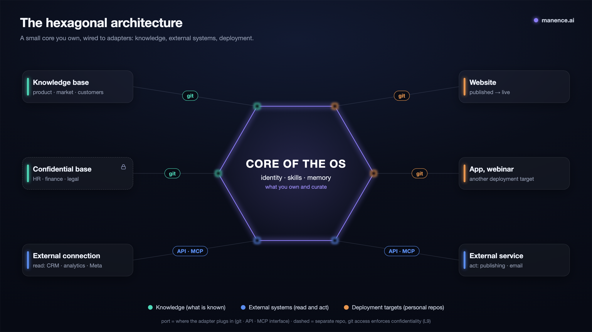

# The hexagonal architecture

## What it is

The 7 layers say *what kinds of things exist*. The hexagonal view says *where the repo boundary falls*: **the OS is not a monolith, it is a small owned core that plugs in adapters.** (A framing specific to the framework, in the spirit of Cockburn's *ports & adapters*.)

- **The core** (what the OS owns and curates): identity (1), skills (3), execution (4), automation (5), memory/drafts (6). Small, clean, portable, non-confidential.
- **The adapters** (plugged in, each with its own life cycle), of two kinds: **knowledge bundles** (*knowing*, layer 2) and **capability bundles** (a skill plus its connector = *doing*, layers 3+7), plus the raw **external systems** (layer 7).
- **The ports**: *knowledge · external system · deployment*. The **interface** can be **git** (a bundle, a site repo → deploy), an **API** (CRM, analytics), or **MCP** (Gmail). The core talks to the port; the adapter handles the transport.

## How it works

### The boundary test
A single question places anything: **"who owns the life cycle of this thing?"** The OS owns it → **core**. It has its own owner / deploy / sharing → **plugged-in adapter**.

### Monolith first (the discipline)
A simple solo project stays **a single repo** (core with `knowledge-base/` inside). You **split out** into adapters only under a **real driving force**: the knowledge becomes **shared** or **confidential**, or a target has its **own deploy**. Same principle as "single agent before the agent group": you add structure only when reality calls for it (otherwise you pay for complexity you don't need).

### The container: the hexagon on disk
When you split out, you keep the repos **in the same place**: a **container directory** that is **not** a git repo, holding the core and its adapters as **sibling repos**. Each plugs in with `--add-dir ../<adapter>` (a clean relative path, one per adapter). "Nothing commits the whole": there is no global history, each brick is versioned on its own. The container also hosts the **production** (`../production/`, outside git: the workstreams and their assets, see [atelier](atelier.md)). This is the hexagon made concrete on disk, without coupling the life cycles.

**A named container = a MOS (Manence OS).** A complete installation of the framework, dedicated to a single activity, *is* a container: the core (the one you run the AI in) plus what it wires in, plus production. "Container" names the structure on disk; "MOS" names the same thing as an installation dedicated to a single activity. One machine can host several of them side by side.

### How many MOS? The system follows the capital
Everyone draws the lines their own way; in practice, the line that holds is **one MOS per ownership/confidentiality perimeter**. This is [the boundary test](#the-boundary-test) raised one level: no longer "who owns this repo?" but "**who owns this activity?**". The reason is the one behind L9: a core holds one activity's decisions, so its readers must coincide with its **rightful owners**; two activities with distinct owners cannot share a core without some rightful owner reading what is none of their business. So you split **when the capital diverges**, not before (monolith first, here at the scale of the installation).

### Confidentiality = composition, not a feature
Each sensitive thing = **its own repo**, plugged in *according to clearance*. It is **git access that enforces the rule** (the "hard" part, see [frontiere-dure](frontiere-dure.md)), never a `visibility:` flag that an agent could ignore.
- **Additive tiers**: a shared bundle plus a confidential delta; the founder plugs in the union, the employee only the shared part.
- **Multiple instances come naturally**: N cores (one per person/role) compose the same bundles, each plugging in only what it is allowed to see.

Two corollaries of this boundary live in [frontiere-dure](frontiere-dure.md): **zero-knowledge** (the shared core does not even mention that a confidential adapter exists) and **sharing is a release, not the repository** (you deploy only a curated subset, never the raw repository).

### Solo → Organization
Three capabilities only appear once there is more than one person, and they form the natural solo / company boundary: **trust tiers** (bundles by clearance), **multiple instances** (one knowledge base, N cores), and **governance**: the record of decisions (*who approved what*, see [double-valeur](double-valeur.md)), which becomes effective human oversight.

### Deploying an instance: release, not repository
Going from one operator to several means **deploying instances of the core**. The dividing line follows the static/dynamic split (L3):
- **You ship the static**: identity, skills, conventions, canonical knowledge — this is the deployable *product*.
- **You start the dynamic empty**: `log.md`, `inbox/`, session memory are **blank per instance**, and each instance mounts **its own production** in the container (outside git; it never travels with the core). Each instance accumulates its own journal; the founder's does not travel.
- **You deploy a release, not the repository**: a **curated subset** (`git clone --depth 1` or a squashed commit), never the working tree or the history (the confidentiality side of L9, covered in [frontiere-dure](frontiere-dure.md)).

This is exactly the line that becomes the **AIOS Solo vs Enterprise** product. You **describe** the path; you build the multi-user machinery only the day it becomes real (single-user first). Details: [Implementation §9](../implementation/Implementation.md).

## Why this shape

A single monolith cannot handle **partial sharing**, **confidentiality**, or **separate deployment cycles** — three needs that show up as soon as you go from solo to several, or as soon as you operate external targets. The hexagonal view solves them through **composition** (you plug in / unplug) rather than features (brittle flags), and keeps the core small, hence portable.

## → Source (verified)
[research/02: Anthropic](research/02-anthropic-architecture.md) grounds the discipline of *"simplest first"* and *single agent before the agent group*, from which "monolith first" follows directly. The **hexagonal** framing itself (core/adapters/ports, confidentiality by composition) is a **synthesis specific to the framework**, in the spirit of Cockburn's *ports & adapters*: no research note grounds it — it is an original contribution of the framework (not borrowed from a primary source).

## → Alongside (the how)
- [Implementation §7: Connecting an adapter](../implementation/Implementation.md): `--add-dir`, `@import`, submodule, and when to split out.
- [Spec §12: Sécurité & confidentialité (dur vs mou)](../implementation/Spec.md): the separate repo as a barrier.

Related concepts: [The hard boundary](frontiere-dure.md) (what enforces confidentiality) · [The wiki method](methode-wiki.md) (the knowledge bundles) · [The loops](loops.md) · [Manifesto](../Manifesto.md).
